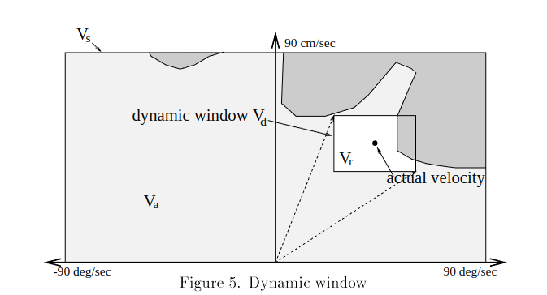
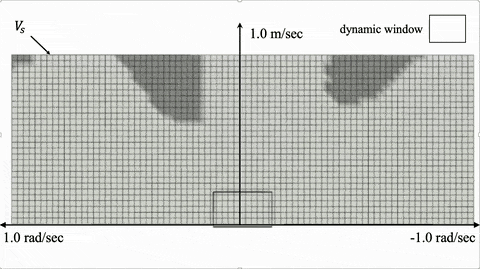
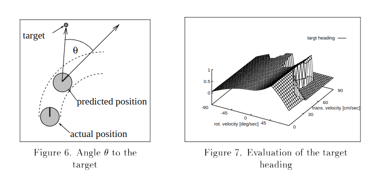
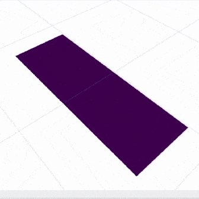
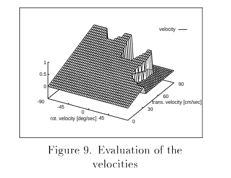
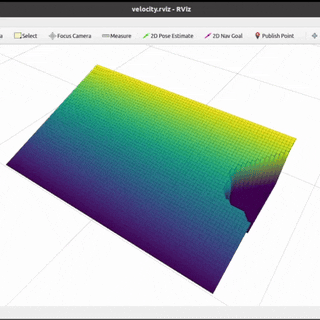
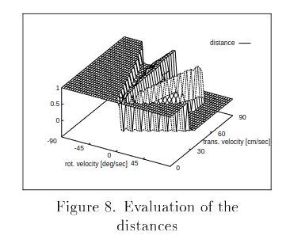
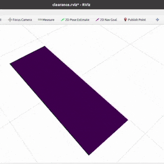
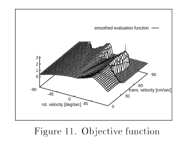

# DWA Planner
This repository provides the ROS implementation of [DWA (dynamic window approach)](https://en.wikipedia.org/wiki/Dynamic_window_approach) for real-time collision avoidance and trajectory planning of mobile robots. Given laser sensor inputs, the `dwa_planner` package computes the optimal linear and angular velocity to reach a goal while avoiding obstacles by pruning velocity candidates with potential collision.

<p align='center'>
    
</p>

This is a research code, expect that it changes often and any fitness for a particular purpose is disclaimed. If you are interested in the simulation tools, see [fake_simulation_ros](https://github.com/Ikhyeon-Cho/fake_simulation_ros) package.

## Features
Our implementation is not only practical in use, but also offers real-time ROS rviz visualizations of the velocity samples from the velocity space. This visualization highlights how the planner evaluates and chooses optimal velocities under varying environmental conditions, thereby aids in understanding of decision-making process of the planner. These provides the valuable insights into the dynamics of trajectory planning and the tuning of hyper-parameters.

### 1. Search Space
The dynamic window approach considers exclusively the first time interval, and assumes that the velocities in the remaining $`n-1`$ time intervals are constant (which is equivalent to assuming zero accelerations in $`t_1 ; t_n`$). During the time interval, the following three aspects are considered for reducing the search space.
- Circular trajectories (thereby, $`v-w`$ space)
- Collision-free velocity samples (indicated by light grey)
- Dynamic window (indicated by moving black square)

We provide the visualization of the resultant search space (including the pruning of velocity, indicated by dark grey) like the figure below:
Dynamic Window (Paper) | Dynamic Window (Rviz) |
:---: | :---: |
 |  |

### 2. Objective Function
With the remaining admissible velocity samples, the dynamic window approach mainly considers the following three discretized cost functions for choosing the best velocity that maximizes the total objective function. 

$$ G(v; \alpha) = \alpha \cdot \text{Heading} (v; w) + \beta \cdot \text{Clearance} (v; w) + \gamma \cdot \text{Velocity} (v; w) $$

If you are interested in the algorithm itself, please refer to the original paper for more information: [The Dynamic Window Approach to Collision Avoidance (1997, Fox et.al.)](https://ieeexplore.ieee.org/abstract/document/580977)

Target Heading (Paper) | Target Heading (Rviz) |
:---: | :---: |
 |  |

Velocity (Paper) | Velocity (Rviz) |
:---: | :---: |
 |  |

Clearance (Paper) | Clearance (Rviz) |
:---: | :---: |
 |  |

Total Objective Function (Paper) | Total Objective Function (Rviz) |
:---: | :---: |
 |  |


## Installation
**Dependencies:** This software is built on the Robotic Operating System ([ROS](https://www.ros.org/)). We assume that the followings are installed.
- Ubuntu (Tested on 20.04) 
- ROS (Tested on [ROS Noetic](https://wiki.ros.org/noetic))
- PCL >= 1.10 (Point cloud library)
- [grid_map](https://github.com/ANYbotics/grid_map) library (For velocity space visualization)


For installation of **`grid_map`**, use the following commands:
```
sudo apt install ros-noetic-grid-map
```

**Build:** In order to install the `dwa_planner` package, clone the latest version from this repository and compile the package.
  ```
  cd ~/{your-ros-workspace}/src
  git clone https://github.com/Ikhyeon-Cho/dwa_planner.git
  cd ..
  catkin build dwa_planner
  ```
**Note:** For the best performance, complie with the option `-DCMAKE_BUILT_TYPE=release`. It makes significant improvements.

## Basic Usage
1. Configure the parameters in `dwa_planner_ros/config/params.yaml`
2. Run the launch file:
  ```
  roslaunch dwa_planner run.launch
  ```
3. To visualize the velocity samples and the corresponding cost values, use the following commands:
```
roslaunch dwa_planner test.launch
``` 
Using `test.launch` will create several publishers and publish messages for testing the whole planning process.

## Nodes
### dwa_planner_node
#### Subscribed Topics
- **`/laser`** ([sensor_msgs/PointCloud2](https://docs.ros.org/en/melodic/api/sensor_msgs/html/msg/PointCloud2.html)) <br>
    The laser for detecting obstacles.

- **`/move_base_simple/goal`** ([geometry_msgs/PoseStamped](https://docs.ros.org/en/noetic/api/geometry_msgs/html/msg/PoseStamped.html)) <br>
    The pose of navigation goal. The goal is internally transformed to the local (typically, base_link) frame. 

- **`/tf`** ([tf2_msgs/TFMessage](https://docs.ros.org/en/jade/api/tf2_msgs/html/msg/TFMessage.html)) <br>
    Transforms from tf tree. The current pose of the robot is obtained by using tf transforms

#### Published Topics
- **`/cmd_vel`** ([geometry_msgs/Twist](https://docs.ros.org/en/noetic/api/geometry_msgs/html/msg/Twist.html)) <br>
    The computed best velocity, published every time during navigation. See `~publish_rate/cmdVel` parameters to specify the publish rate.

- **`/dwa_planner_node/path/plan_best`** ([visualization_msgs/Marker](https://docs.ros.org/en/noetic/api/visualization_msgs/html/msg/Marker.html)) <br>
    The predicted best path by assuming circular trajectories during the time horizon.

- **`/dwa_planner_node/path/plan_best_circle`** ([visualization_msgs/MarkerArray](https://docs.ros.org/en/noetic/api/visualization_msgs/html/msg/MarkerArray.html)) <br>
    The predicted best path with the robot radius. 

- **`/dwa_planner_node/path/plan_candidates`** ([visualization_msgs/MarkerArray](https://docs.ros.org/en/noetic/api/visualization_msgs/html/msg/MarkerArray.html)) <br>
    The admissible paths without collision. The objective function selects the best path among these path candidates.

#### Parameters
- **`~robot/maxVelocity`** (tuple, default: [1.0, 1.0] ) <br>
    The maximum velocity ($v, w$) of the robot. 

- **`~robot/enableBackwardMotion`** (bool, default: false) <br>
    If true, the velocity search space has negative velocity regions.

- **`~collision/robotRadius`** (double, default: 1.0) <br>
    The size of the robot, assuming the circular shaped robot. The value is used for collision checking and emergency stop.

- **`~collision/safetyMargin`** (double, default: 0.0) <br>
    The safety margin which will be added to the robot radius.

- **`~collision/timeHorizon`** (double, default: 3.0) <br>
    The time interval for making circular trajectories by constant velocity.

- **`~collision/maxLaserRange`** (double, default: 10.0) <br>
    The maximum range of the laser input that the dwa will be used for collision checking.

- **`~cost_function/targetHeading`** (double, default: 2.0) <br>
    The weight for the *target heading* objective.
  
- **`~cost_function/clearance`** (double, default: 0.2) <br>
    The weight for the *clearance* objective.

- **`~cost_function/velocity`** (double, default: 0.2) <br>
    The weight for the *velocity* objective.

- **`~status/goalReachedRadius`** (double, default: 0.2) <br>
    The tolerance of the distance to the goal that will be accepted as *arrived*. 

- **`~publish_rate/cmdVel`** (double, default: 10.0) <br>
    The publish rate of the computed velocity command. 

- **`~publish_rate/dynamicWindow`** (double, default: 10.0) <br>
    For the testing purpose. The publish rate of the velocity window and the corresponding cost values.

## Citation
If you find this project useful, please cite our paper:

```bibtex
@article{lee2022odsbot,
  title={ODS-Bot: Mobile robot navigation for outdoor delivery services}, 
  author={Jinwon Lee, Geonhyeok Park, Ikhyeon Cho, Keundong Kang, Daehyun Pyo, Soohyun Cho, Minwoo Cho, and Woojin Chung},
  journal={IEEE Access}, 
  year={2022},
  volume={10},
  pages={107250-107258},
  doi={10.1109/ACCESS.2022.3212768}
}
```