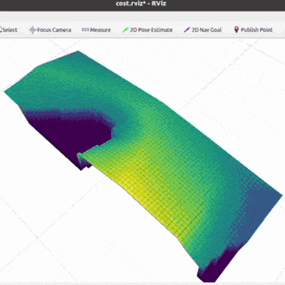

# dwa planner
This repository provides the ROS implementation of [DWA (dynamic window approach)](https://en.wikipedia.org/wiki/Dynamic_window_approach) for real-time collision avoidance and trajectory planning of mobile robots. Given laser sensor inputs, the `dwa_planner` package computes the optimal linear and angular velocity to reach a goal while avoiding obstacles by pruning velocity candidates with potential collision.

<p align='center'>
    
</p>

This is a research code, expect that it changes often and any fitness for a particular purpose is disclaimed. If you are interested in the simulation tools, see [fake_simulation_ros](https://github.com/Ikhyeon-Cho/fake_simulation_ros) ROS package.

## Features
Our implementation is not only practical in use, but also offers real-time ROS rviz visualizations of the velocity samples from the velocity space. This visualization highlights how the planner evaluates and chooses optimal velocities under varying environmental conditions, thereby aids in understanding of decision-making process of the planner. These provides the valuable insights into the dynamics of trajectory planning and the tuning of hyper-parameters.

### 1. Search Space
The dynamic window approach considers exclusively the first time interval, and assumes that the velocities in the remaining $`n-1`$ time intervals are constant (which is equivalent to assuming zero accelerations in $`t_1 ; t_n`$). During the time interval, the following three aspects are considered for reducing the search space.
- Circular trajectories within time interval ($`v,w`$ space)
- Collision-free velocity samples (indicated by light grey)
- Dynamic window (indicated by moving black square)

We provide the visualization of the resultant search space (including the pruning of velocity, indicated by dark grey) like the figure below:
Dynamic Window (Paper) | Dynamic Window (Rviz) |
:---: | :---: |
 |  |

### 2. Objective Function
With the remaining admissible velocity samples, the dynamic window approach mainly considers the following three discretized cost functions for choosing the best velocity that maximizes the total objective function. 

$$ G(v; \alpha) = \alpha \cdot \text{Heading} (v; w) + \beta \cdot \text{Clearance} (v; w) + \gamma \cdot \text{Velocity} (v; w) $$

If you are interested in the algorithm itself, please refer to the original paper for more information: [The Dynamic Window Approach to Collision Avoidance (1997, Fox et.al.)](https://ieeexplore.ieee.org/abstract/document/580977)

Target Heading (Paper) | Target Heading (Rviz) |
:---: | :---: |
 |  |

Velocity (Paper) | Velocity (Rviz) |
:---: | :---: |
 |  |

Clearance (Paper) | Clearance (Rviz) |
:---: | :---: |
 |  |

Total Objective Function (Paper) | Total Objective Function (Rviz) |
:---: | :---: |
 |  |


## Installation
**Dependencies:** This software is built on the Robotic Operating System ([ROS](https://www.ros.org/)). We assume that the followings are installed.
- Ubuntu (Tested on 20.04) 
- ROS (Tested on [ROS Noetic](https://wiki.ros.org/noetic))
- PCL >= 1.10 (Point cloud library)
- [grid_map](https://github.com/ANYbotics/grid_map) library


For installation of **`grid_map`**, use the following commands:
```
sudo apt install ros-noetic-grid-map
```

**Build:** In order to install the `dwa_planner` package, clone the latest version from this repository and compile the package.
  ```
  cd ~/{your-ros-workspace}/src
  git clone https://github.com/Ikhyeon-Cho/dwa_planner.git
  cd ..
  catkin build dwa_planner
  ```
**Note:** For the best performance, complie with the option `-DCMAKE_BUILT_TYPE=release`. It makes significant improvements.

## Basic Usage
1. Configure the parameters in `dwa_planner_ros/config/params.yaml`
2. Run the launch file:
  ```
  roslaunch dwa_planner run.launch
  ```

#### Subscribed Topics
- **`/map`** ([nav_msgs/OccupancyGrid](https://docs.ros.org/en/noetic/api/nav_msgs/html/msg/OccupancyGrid.html))
The map for planning.

- **`/move_base_simple/goal`** ([geometry_msgs/PoseStamped](https://docs.ros.org/en/noetic/api/geometry_msgs/html/msg/PoseStamped.html))
The pose of navigation goal. When the goal message is not in the map frame, it is internally transformed to the map frame. 

- **`/tf`** ([tf2_msgs/TFMessage](https://docs.ros.org/en/jade/api/tf2_msgs/html/msg/TFMessage.html))
Transforms from tf tree. The current pose of the robot is obtained by using tf transforms

#### Published Topics
- **`/wavefront_planner/path`** ([nav_msgs/Path](https://docs.ros.org/en/noetic/api/nav_msgs/html/msg/Path.html))
The computed path, published every time during navigation. See `~pathPublishRate` parameters to specify the publish rate.

- **`/wavefront_planner/debug/costmap`** ([grid_map_msgs/GridMap](https://docs.ros.org/en/kinetic/api/grid_map_msgs/html/msg/GridMap.html))
For debug purpose. Visualize the costmap.

- **`/wavefront_planner/debug/costmap`** ([nav_msgs/OccupancyGrid](https://docs.ros.org/en/noetic/api/nav_msgs/html/msg/OccupancyGrid.html))
For debug purpose. Visualize the occupancy map that the planner perceives.


#### Parameters
- **`~baselinkFrame`** (string, default: base_link)
    The frame id of the robot. Inside the code, transform to this parameters will be used for robot pose calculation.

- **`~mapFrame`** (string, default: map)
    The frame id of the map. Inside the code, transform to this parameters will be used for robot pose calculation.

- **`~pathPublishRate`** (double, default: 20 Hz)
    The publish rate of the path.

- **`~propagateUnknownCell`** (bool, default: false)
    If set true, then the wave propagation will search the unknown state regions.

- **`~inflationRadius`** (double, default: 0.5 meter)
    The inflation range. Consider the robot size and set the value accordingly.

- **`~debugMode`** (bool, default: false)
    If set true, the node will publish the costmap and the received occupancy map.


  
  

